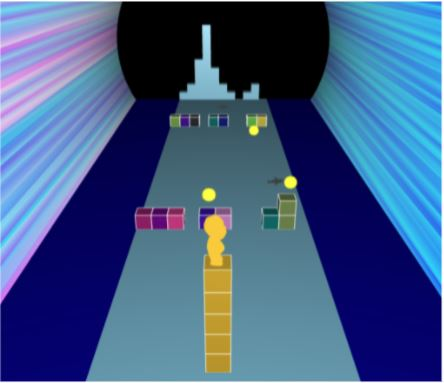

# Music Surfer

## Overview
Music Surfer is a runner-style game similar to Temple Run with gameplay centered around audio. The player surfs on a tower of blocks that gets taller as he collects coins. Moving walls appear in the player's path based on the frequency of the music and sharks also randomly spawn. The player's objective is to avoid the obstacles by moving laterally across the screen. The player loses if he hits a shark or he hits too many obstacles and runs out of blocks to surf on.

## Controls
- Ctrl+0 to start
- Use keys 'A' and 'D' to move (must be capital)

## How to Run
- Open the ``host.bat`` file (Windows) or the ``host.command`` file (Mac)
- Navigate to url http://localhost:8000/

## Advanced Features
### Collision Detection
We detect collision between the player and the obstacle blocks, sharks, and tokens.

### Physics
The player has movement acceleration when moving left and right. When colliding with a wall of blocks, the player also falls with gravitational acceleration.

## Contributors
- Lawrence Fu
- Ronny Chen
- Richard Chung
- Jeffrey Liu
